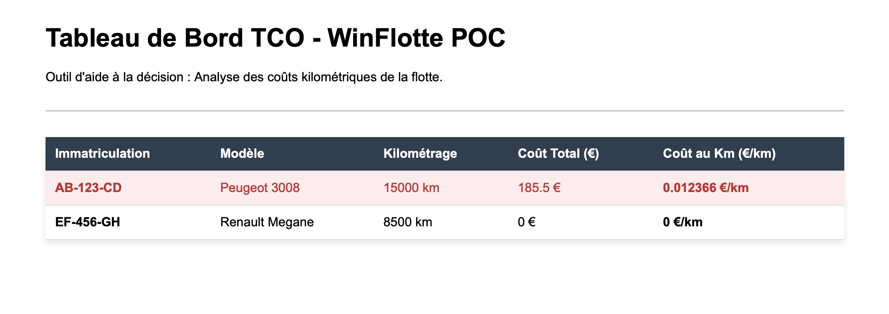

# 🚗 POC MiniFleet - Candidature OptiXT (Réf : AP.OPT.03)

Bonjour ! Je m'appelle Yahya Bahloul, étudiant en Master 2. 
J'ai réalisé ce petit projet (Proof of Concept) pour accompagner ma candidature au stage en informatique chez OptiXT.

Mon objectif avec ce code est simple : vous montrer ma motivation et que je peux m'adapter très vite à votre environnement technique (C# et SQL Server), même si mon parcours était plus orienté Java.



## 🎯 Ce que fait l'application

J'ai lu que votre logiciel WinFlotte aide à la maîtrise des coûts (TCO) et à l'aide à la décision. J'ai donc codé une version miniature avec :
* **Une base de données SQL** qui stocke des véhicules et des dépenses.
* **Une vue SQL spécifique** qui calcule automatiquement le coût total et le coût par kilomètre (CPK).
* **Une interface web** qui affiche ces données et met en rouge les véhicules qui coûtent trop cher au kilomètre.

## 🛠️ Technologies utilisées

* **Backend :** API REST en C# avec .NET 8 et Entity Framework Core.
* **Base de données :** Microsoft SQL Server. (Comme je travaille sur un Mac avec puce ARM, j'ai configuré SQL Server pour qu'il tourne dans un conteneur Docker ).
* **Frontend :** Angular 17 avec TypeScript.

## 🚀 Comment tester le projet chez vous ?

Si vous souhaitez faire tourner mon code, voici les commandes :

### 1. La base de données (Docker)
```bash
docker run -e 'ACCEPT_EULA=Y' -e 'MSSQL_SA_PASSWORD=OptiXTPOC2026#' -p 1433:1433 --name optifleet_db --platform linux/amd64 -d mcr.microsoft.com/mssql/server:2022-latest
```
*(Les tables et la fausse data sont générées via le script SQL présent dans le projet).*

### 2. Lancer l'API C#
```bash
cd MiniFleet.API
dotnet run
# L'API va tourner sur http://localhost:5050
```

### 3. Lancer l'interface Angular
Dans un autre terminal :
```bash
cd MiniFleet.Web
npm install
npm start
# Le site sera visible sur http://localhost:4200
```

---
*Merci pour votre temps et bonne lecture de mon code !*